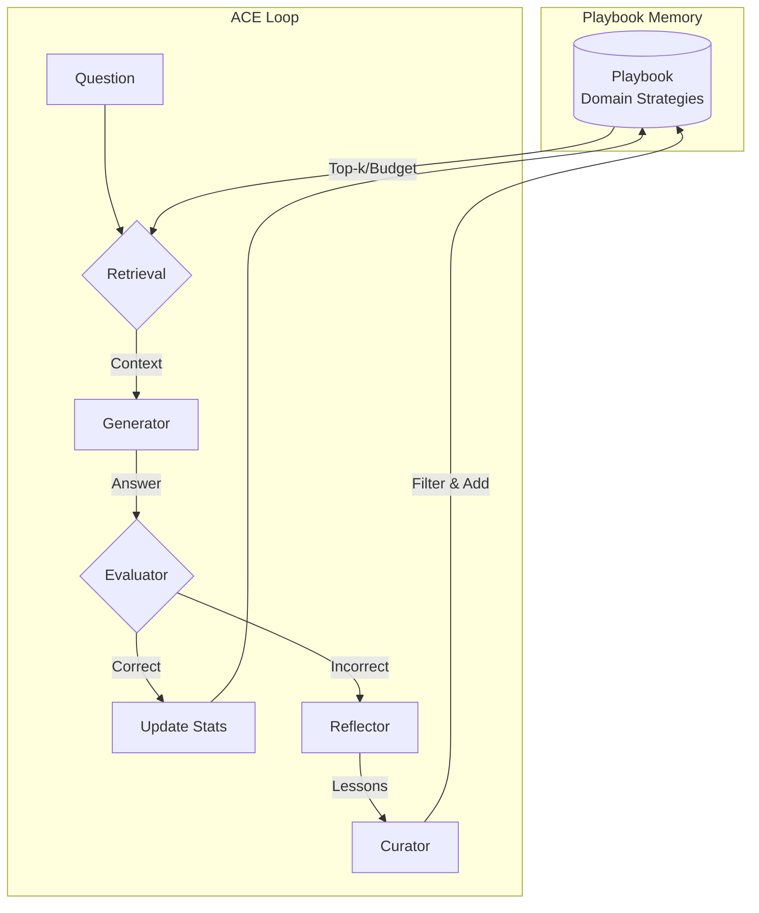

# TinyACE: Agentic Context Engineering for Small Language Models

<div align="center">

**Domain-Specific Benchmarking of Small Language Models on Edge Devices via Agentic Context Engineering**

[](https://opensource.org/licenses/Apache-2.0)
[](https://www.python.org/)
[](https://github.com/psf/black)

</div>

---

## 📖 Abstract

Small Language Models (SLMs) like Phi-3 and TinyLlama are efficient for edge deployment but often lack the reasoning depth of larger models. **TinyACE** (Agentic Context Engineering) is a framework that enables SLMs to "self-improve" without fine-tuning by maintaining a dynamic **Playbook Memory** of domain-specific strategies.

Instead of updating model weights, TinyACE evolves the prompt context through a feedback loop: **Generate → Reflect → Curate → Memorize**. This approach enables domain-specific adaptation while maintaining the efficiency benefits of small models.

### Key Contributions

- 🧠 **Playbook Memory System**: Dynamic accumulation of domain-specific strategies without fine-tuning
- 📊 **Retention Scoring**: Multi-component scoring formula for strategic forgetting
- 💾 **Token-Budgeted Memory**: Efficient memory management for edge devices (256/512 token budgets)
- 🔬 **Comprehensive Ablation Studies**: Systematic analysis of scoring components
- 📈 **Model-Dependent Analysis**: Evaluation across Mistral 7B, Phi-3 Mini, and TinyLlama 1.1B

---

## 🎯 Key Results

### Model Performance (SciQ Test Dataset)

| Model | Baseline OMA | Best ACE OMA | Improvement | Key Finding |
|-------|--------------|--------------|-------------|-------------|
| **Mistral 7B** | 96% | 94% | -2% | Baseline preferred; ACE adds overhead |
| **Phi-3 Mini** | 74% | **78%** | **+4%** | FIFO eviction achieves best performance |
| **TinyLlama 1.1B** | 72% | 46% | -26% | Baseline preferred; ACE degrades performance |

**Insight**: ACE is most effective for medium-capability models (3-4B parameters).

### Ablation Study Results (Phi-3 Mini, 256 token budget)

| Configuration | OMA Accuracy | Semantic Similarity | Key Finding |
|--------------|--------------|---------------------|-------------|
| Baseline | 74% | 0.385 | Baseline performance |
| **FIFO Eviction** | **78%** | 0.469 | **Best OMA** - Simple eviction outperforms complex scoring |
| No Recency | 72% | **0.495** | Best semantic similarity |
| No Failure | 70% | 0.466 | Critical component (4% drop without it) |
| No Vagueness | 72% | 0.421 | Prevents playbook bloat |

**Key Finding**: FIFO eviction achieves the best OMA (78%), suggesting complex scoring may be unnecessary for this task.

---

## 🏗️ System Architecture

TinyACE implements a feedback loop that freezes model weights but evolves the prompt context:



### Retention Scoring Formula

Lessons are scored and evicted based on:

$$S(l_i, t) = \alpha \cdot \frac{N_{succ}}{N_{used}+\epsilon} - \beta \cdot \frac{N_{fail}}{N_{used}+\epsilon} + \gamma \cdot e^{-\lambda(t-t_{last})} - \delta \cdot V(l_i)$$

Where:
- **Success Term** ($\alpha=1.0$): Rewards entries leading to correct answers
- **Failure Term** ($\beta=0.5$): Penalizes entries leading to incorrect answers
- **Recency Term** ($\gamma=0.3$): Bonus for recently used entries
- **Vagueness Term** ($\delta=0.4$): Penalty for generic/vague lessons

---

## 📂 Repository Structure

```
TINY ACE/
├── src/edge_slm_ace/          # Core package
│   ├── core/                  # ACE loop implementation
│   │   ├── ace_roles.py      # Generator, Reflector, Curator
│   │   └── runner.py          # Main evaluation loop
│   ├── memory/                # Playbook system
│   │   └── playbook.py       # Retention scoring & eviction
│   ├── models/                # Model management
│   └── utils/                  # Metrics & configuration
├── scripts/                    # CLI tools
│   ├── run_experiment.py     # Single experiment runner
│   ├── run_eval_grid.py      # Grid experiment runner
│   └── tinyace_plots.py      # Visualization pipeline
├── configs/                    # Configuration files
│   └── experiment_grid.yaml   # Experiment configuration
├── docs/                       # Documentation
│   ├── ARCHITECTURE.md        # System design details
│   ├── RESULTS.md             # Experimental results
│   └── guides/                # User guides
├── data/                       # Datasets
└── tests/                      # Test suite
```

---

## 🚀 Quick Start

### Installation

```bash
# Clone repository
git clone https://github.com/SirAlchemist1/edge-slm-ace.git
cd edge-slm-ace

# Create virtual environment
python -m venv venv
source venv/bin/activate  # On Windows: venv\Scripts\activate

# Install dependencies
pip install -r requirements.txt
pip install -e .
```

### Run a Single Experiment

```bash
# Baseline evaluation
python -m scripts.run_experiment \
  --model-id microsoft/Phi-3-mini-4k-instruct \
  --task-name sciq_test \
  --mode baseline \
  --device cuda

# ACE Working Memory (256 token budget)
python -m scripts.run_experiment \
  --model-id microsoft/Phi-3-mini-4k-instruct \
  --task-name sciq_test \
  --mode ace \
  --ace-mode ace_working_memory \
  --token-budget 256 \
  --device cuda
```

### Run Full Evaluation Grid

```bash
# Run all experiments (models × tasks × modes)
python -m scripts.run_eval_grid --config configs/experiment_grid.yaml

# Dry run (preview commands)
python -m scripts.run_eval_grid --config configs/experiment_grid.yaml --dry-run
```

### Generate Visualizations

```bash
# Generate all plots from results
python -m scripts.tinyace_plots

# Custom paths
python -m scripts.tinyace_plots --results_dir results --output_dir plots
```

---

## ⚙️ Configuration

Edit `configs/experiment_grid.yaml` to customize experiments:

```yaml
models:
  - name: phi-3-mini
    hf_id: microsoft/Phi-3-mini-4k-instruct

modes:
  - name: baseline
  - name: tinyace_wm_256
    ace_mode: ace_working_memory
    working_memory_token_budget: 256
  - name: tinyace_fifo
    fifo_memory: true  # Use FIFO eviction

devices:
  - cuda  # NVIDIA GPU
  - mps   # Apple Silicon
```

See [configs/experiment_grid.yaml](configs/experiment_grid.yaml) for all options.

---

## 📊 Experimental Results

### Model Comparison Summary

**Mistral 7B Instruct:**
- Baseline: 96% OMA, 0.823 semantic similarity, 0.41s latency
- ACE modes add ~1.4s overhead with minimal benefit
- **Conclusion**: Strong models don't benefit from ACE

**Phi-3 Mini:**
- Baseline: 74% OMA, 0.385 semantic similarity
- Best ACE (FIFO): 78% OMA, 0.469 semantic similarity (+4% OMA, +0.084 semantic)
- **Conclusion**: Medium models benefit significantly from ACE

**TinyLlama 1.1B:**
- Baseline: 72% OMA, 0.659 semantic similarity
- ACE modes degrade performance (34-46% OMA)
- **Conclusion**: Very small models are confused by playbook context

### Ablation Study Insights

1. **FIFO Eviction**: Best overall performance (78% OMA)
2. **Failure Tracking**: Critical component (4% drop without it)
3. **Recency Bias**: Trade-off (accuracy vs. semantic quality)
4. **Vagueness Detection**: Prevents playbook bloat

See [docs/RESULTS.md](docs/RESULTS.md) for comprehensive analysis.

---

## 📚 Documentation

- **[Architecture Guide](docs/ARCHITECTURE.md)** - Complete system design and implementation
- **[Results Analysis](docs/RESULTS.md)** - Detailed experimental findings
- **[Plotting Guide](PLOTTING_GUIDE.md)** - Visualization instructions
- **[Documentation Index](docs/README.md)** - Full documentation index

---

## 🔬 Key Features

- ✅ **Three Evaluation Modes**: Baseline, ACE Full, ACE Working Memory
- ✅ **Token-Budgeted Memory**: Strategic forgetting for edge devices
- ✅ **Retention Scoring**: Multi-component scoring system
- ✅ **Ablation Support**: Systematic component analysis
- ✅ **Multi-Device Support**: CPU, CUDA, MPS (Apple Silicon)
- ✅ **Comprehensive Metrics**: OMA accuracy, semantic similarity, latency

---

## 📝 Citation

If you use this codebase in your research, please cite:

```bibtex
@software{tinyace2024,
  title={TinyACE: Domain-Specific Benchmarking of Small Language Models for Edge Devices with Agentic Context Engineering},
  author={Shahi, Suryodaya and Collaborators},
  year={2024},
  url={https://github.com/SirAlchemist1/edge-slm-ace},
  note={Workshop Paper}
}
```

**Paper**: See `TinyAce-3.pdf` for the full technical report.

---

## 📄 License

This project is licensed under the Apache License 2.0 - see the [LICENSE](LICENSE) file for details.

---

## 🙏 Acknowledgments

- HuggingFace for model hosting and transformers library
- The open-source community for tools and libraries

---

## 📧 Contact

For questions or issues, please open an issue on GitHub or contact the maintainers.

---

## 📖 Paper

The full technical report is available as `TinyAce-3.pdf` in the repository root.

**Paper Title**: "Domain-Specific Benchmarking of Small Language Models for Edge Devices with Agentic Context Engineering (ACE)"

---

<div align="center">

**Made with ❤️ for the edge AI community**

[Report Issue](https://github.com/SirAlchemist1/edge-slm-ace/issues) · [Request Feature](https://github.com/SirAlchemist1/edge-slm-ace/issues) · [Documentation](docs/README.md)

</div>
